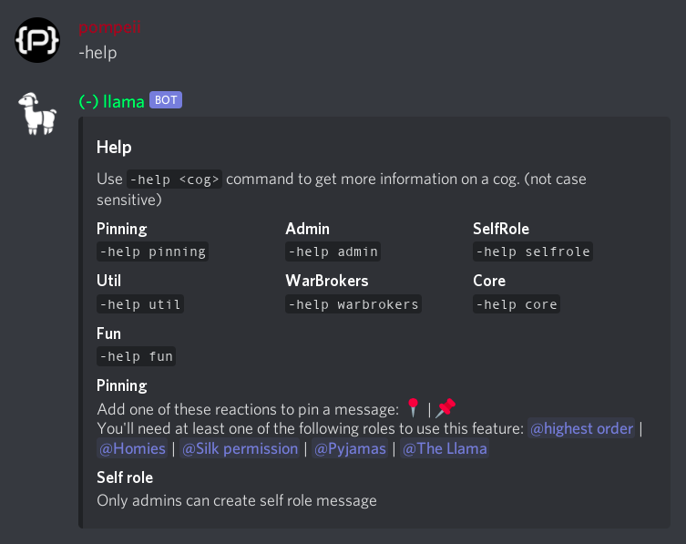

# llama bot


> **WARNING: THIS REPOSITORY CONTAINS NSFW CONTENT**



- Discord bot made for [one specific server](https://dsc.gg/llama). It most likely will not function properly on other discord servers.
- Invitation of this bot to other server is blocked. You'll have to host the bot yourself if you want it on your discord server.
- It's not designed with ease of use for others in mind. This is a personal project, so you'll have to figure things out on your own. Documentations will not be provided.
- The bot is still under construction, so you may find a ton of inconsistencies and missing features. Feel free to create a github issue.
- WarBrokers feature is completely unavailable for the public, and it wil stay that way.
- The bot requires Python version 3.9 or greater.

# Setup
> assumes you already know how to use firebase, python, and discord bots

1. Clone this repo
   - `git clone --depth 1 https://github.com/developomp/discord-warbrokers-llama.git` to save space
2. create `secrets` directory
3. Create a new discord bot
   - https://discord.com/developers/applications
4. Create a firebase project and enable firestore
   - https://console.firebase.google.com
5. Generate and download service account key from firebase
   - https://console.firebase.google.com/project/_/settings/serviceaccounts/adminsdk
6. put `TOKEN` and service account key in `secrets` directory
7. create `config.json` and put token and key location
   ```json
   {
     "token": "secrets/TOKEN",
     "firestore": "secrets/<key-name>.json"
   }
   ```
8. Install dependencies
   - `discord.py`
   - `firebase_admin`
   - `nekos.py`
   - `Pillow`
9. Rename `cogs/WarBrokers.py` to `cogs/_WarBrokers.py` (add a underscore) to disable it.

More info:
   - https://firebase.google.com/docs/admin/setup#initialize-sdk
   - https://discordpy.readthedocs.io/en/latest/quickstart.html
   - https://discord.com/developers/docs

# Contacting
Feel free:
- To submit an issue in the [github issue page](https://github.com/developomp/discord-warbrokers-llama/issues)
- To DM me in [discord](https://discord.com) (developomp#0001)
- To send an email (developomp@gmail.com)

Any feedback is welcomed.
