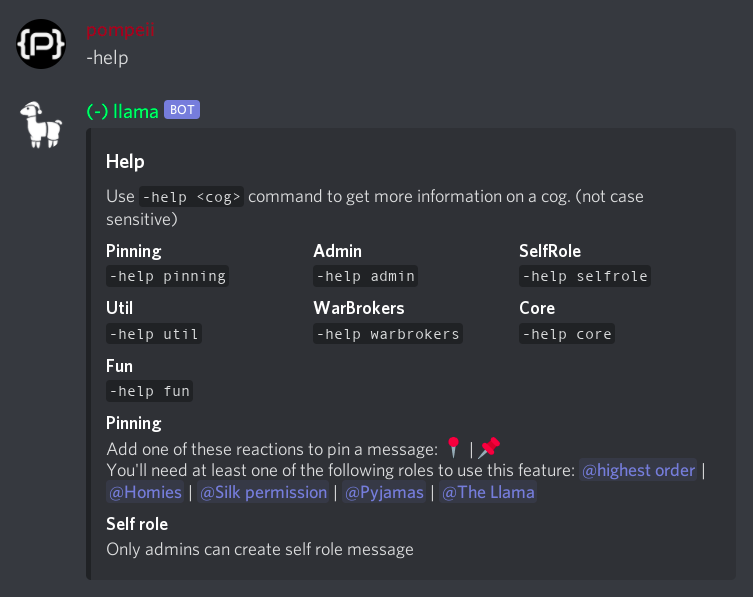

# Llama bot



The Llama bot is a [discord](https://discord.com) bot made for the
[LP community discord server](https://discord.gg/2fsar34APa).<br />

## Setting up

### Pre-requirements

- Node.js 16.6.0+
- [yarn](https://yarnpkg.com)
- A Discord account
- A Google Firebase account
- ~~A sacrifice to be given to the llama gods~~ (no longer needed)

### Discord

1. Create a new application from the [Discord Developer Portal](https://discord.com/developers/applications). Select one if you already have it.
2. Go to the `Bot` tab and convert your application to a discord bot. Be cautious since this operation is **NOT REVERSIBLE**.
3. Copy the bot token. This will be used during the [Server](#server) setup.

### Firebase

1. Head over to https://console.firebase.google.com and create a firebase project.
2. Enable firestore database.
3. [Generate and download](https://console.firebase.google.com/project/_/settings/serviceaccounts/adminsdk) the service account key.
   This will be used during the [Server](#server) setup.

### Server

- Assumes UNIX-like environment (Linux, BSD, Mac, etc.)

1. Clone this repository and open it.

   ```bash
   git clone https://github.com/llama-bot/llama-bot.git
   ```

   ```bash
   cd llama-bot
   ```

2. Install dependencies.

   ```bash
   yarn install
   ```

3. Create `.env` file in the project root and put the discord bot token generated during the [Discord](#discord) setup.

   ```dosini
   TOKEN=PUT_YOUR_DISCORD_BOT_TOKEN_HERE
   TESTING=true # set it to false on production
   PREFIX_PROD=PUT_PRODUCTION_DEFAULT_PREFIX_HERE
   PREFIX_DEV=PUT_DEVELOPMENT_DEFAULT_PREFIX_HERE
   OWNER_IDS=ID1,ID2,ID3,...
   ```

4. Create `secret` directory in the `src` directory,
   rename the firebase admin key generated during the [Firebase](#firebase) setup to `firebase-adminsdk.json`,
   and put it in the `secret` directory.

5. Build the bot.

   ```bash
   yarn build
   ```

6. Install pm2 globally.

   ```bash
   yarn global add pm2
   ```

7. Start the bot.

   ```bash
   pm2 start build/index.js --watch --name "Llama Bot"
   ```

   | Option               | Explanation                                                |
   | -------------------- | ---------------------------------------------------------- |
   | `--watch`            | Auto restart bot if bot files have been changed            |
   | `--name "Llama Bot"` | Set the name of the process so it can be easily recognized |

8. Make the process automatically start on boot.

   ```bash
   pm2 startup
   ```

## More info

- [discord developers documentation](https://discord.com/developers/docs)
- discord API's javascript implementation [documentation](https://discord.js.org/#/docs), [guide](https://discordjs.guide), and bot [framework documentation](https://sapphiredev.github.io/framework)
- [firebase admin sdk documentation](https://firebase.google.com/docs)
- [pm2 documentation](https://pm2.keymetrics.io/docs/usage/quick-start)

## Special thanks

- `Dabidoo#9888 (265697563280146433)` for making the [colored logo](./.github/img/logo.png)
- `Sɪʟᴋ Sᴘɪᴅᴇʀ#8364 (419184817368858644)` for making the [white logo](./.github/img/logo-white.png)
